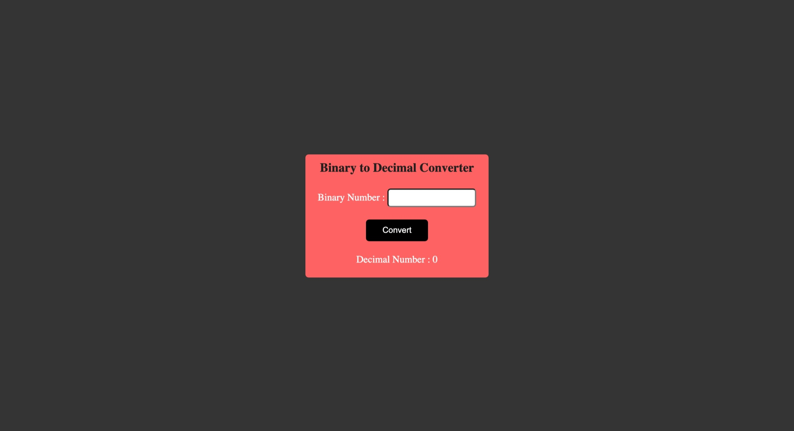

# Binary to Decimal converter

- This is a Binary to Decimal converter, made using HTML, CSS and Javascript

## Screenshot

## Built with

- Semantic HTML5 markup
- CSS custom properties
- media query
- Javascript

## What I learned
- Usage of parseInt() to convert binary number to decimal number.
- Usage of Regular Expression to take input of only 1 and 0.
- How to stop form from reloding after submiting the form. 
- How to remove increment decriment in input form.

## Time taken
- It took me around 1 hours to built this website from scratch.

## Links
- [live demo](https://binary2decimal-converstion.netlify.app/)
- [source](https://github.com/RAM844/Binary2Decimal-using-Javascript)

## Contact me
- GitHub - [@RAM844](https://github.com/RAM844)
- Twitter - [@ShriramBalaji7](https://www.twitter.com/ShriramBalaji7)

